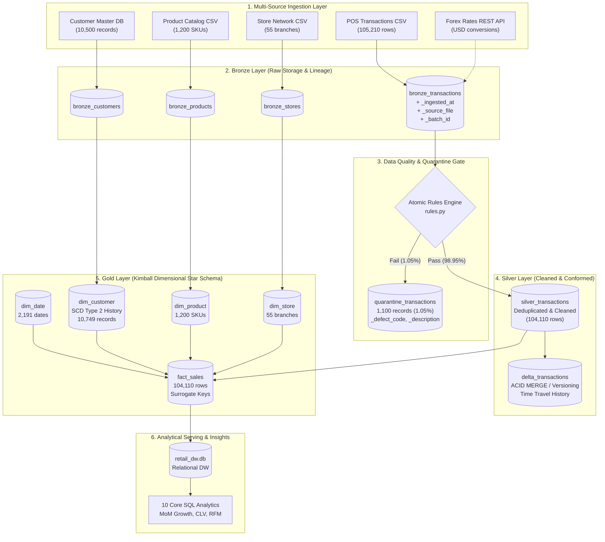
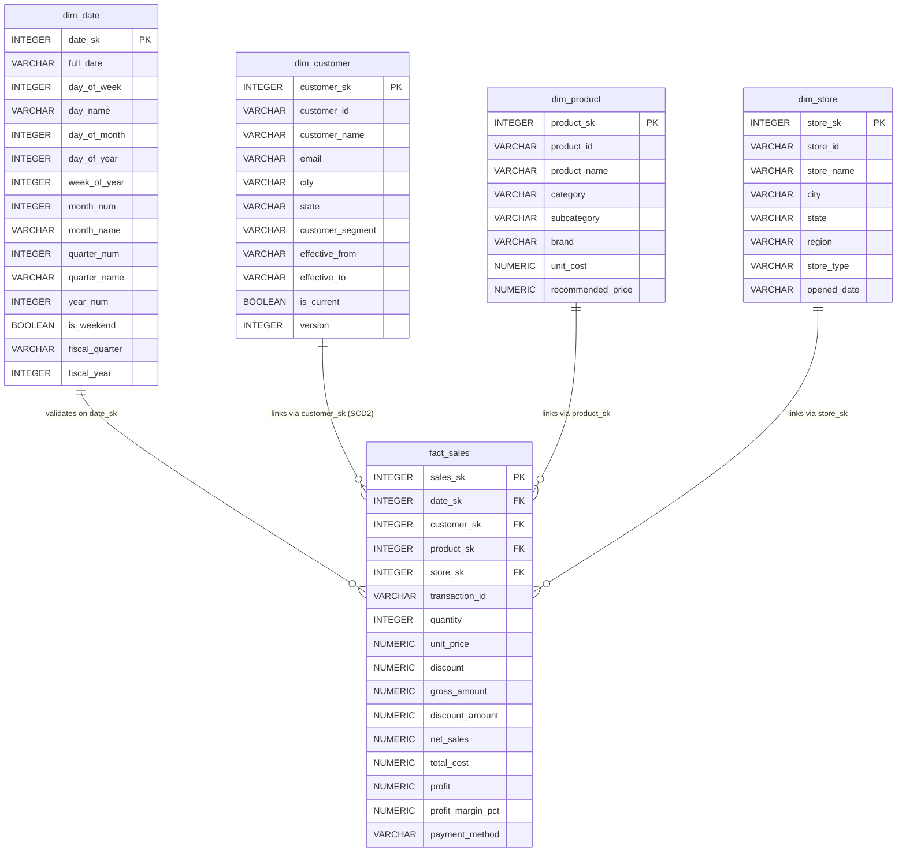
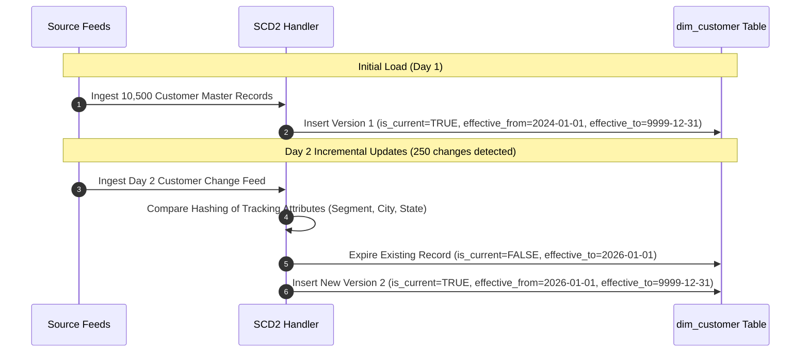

# Enterprise Lakehouse Architecture & Lineage Diagrams
**Project:** Retail Data Engineering Pipeline — End-to-End Lakehouse Analytics  
**Target Role:** Celebal Technologies Data Engineer Evaluation  
**Diagram Formats:** Mermaid.js & ASCII Diagrams for Technical Presentations & Architecture Reviews

---

## 1. End-to-End Lakehouse Medallion Pipeline (Mermaid)



---

## 2. Kimball Star Schema Entity-Relationship Diagram (ERD)



---

## 3. Slowly Changing Dimensions (SCD Type 2) Lifecycle Flow



---

## 4. Azure Enterprise Production Architecture

```text
       +-----------------------------------------------------------------------------------------+
       |                                Microsoft Azure Cloud                                    |
       |                                                                                         |
       |  +-----------------------------+         +--------------------------------------------+ |
       |  |     Azure Data Factory      |         |     Azure Data Lake Storage Gen2 (ADLS)    | |
       |  |  (Pipelines & Triggers)     |-------->|  - abfss://landing@retaildls.dfs.core/     | |
       |  +--------------+--------------+         |  - abfss://bronze@retaildls.dfs.core/      | |
       |                 |                        |  - abfss://silver@retaildls.dfs.core/      | |
       |                 | (Orchestrates DAG)     |  - abfss://gold@retaildls.dfs.core/        | |
       |                 v                        +---------------------+----------------------+ |
       |  +-------------------------------------+                       |                        |
       |  |         Azure Databricks            |<----------------------+ (Reads/Writes Delta)   |
       |  |  - Unity Catalog Governance         |                                                |
       |  |  - Multi-task Notebook Workflows    |                                                |
       |  |  - Liquid Clustering (Opt. Storage) |                                                |
       |  +--------------+----------------------+                                                |
       |                 |                                                                       |
       |                 v                                                                       |
       |  +-------------------------------------+         +------------------------------------+ |
       |  |   Azure Synapse / Fabric Warehouse  |         |        Power BI DirectLake         | |
       |  |   (MPP Relational Serving Layer)    |-------->|   (Executive KPIs & Analytics)     | |
       |  +-------------------------------------+         +------------------------------------+ |
       |                                                                                         |
       |  Cross-Cutting Security & Monitoring:                                                   |
       |  - Azure Key Vault (Managed Identities & Zero Secret Storage)                           |
       |  - Azure Monitor & Log Analytics (KQL Queries & Alerts)                                 |
       |  - Microsoft Entra ID (Role-Based Access Control - RBAC)                                |
       +-----------------------------------------------------------------------------------------+
```
